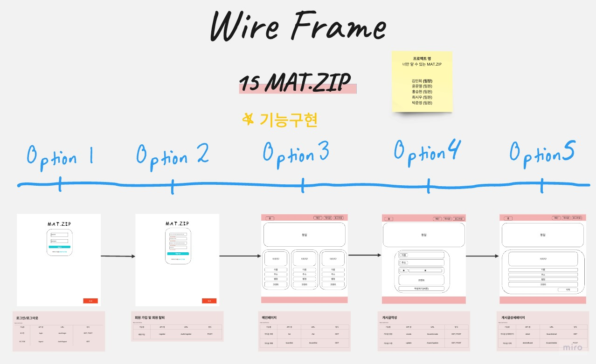
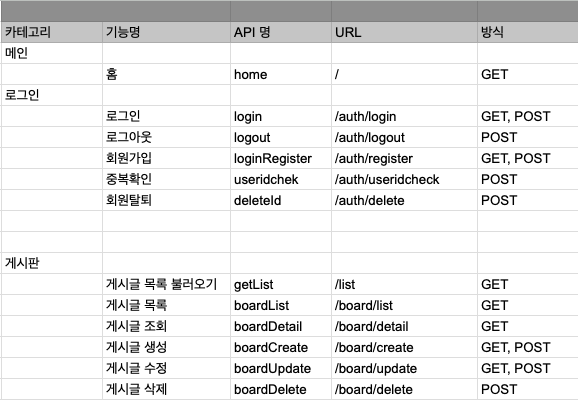
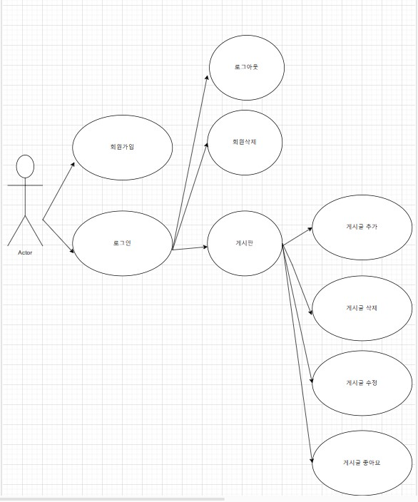
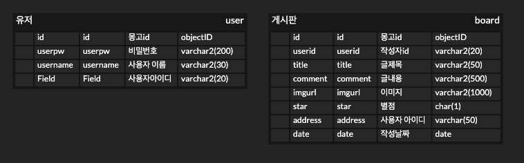

# 항해 15조 웹 미니 프로젝트

## MAT.ZIP

> 사용자들의 맛집정보를 공유하는 간단한 게시판입니다.
> CRUD 를 경험할 수 있었던 프로젝트 였고, 팀원과의 협업을 경험해 볼 수 있었던 프로젝트였습니다.

---

## 실행 설명

- 실행 파일 이름 : app.py
  - Mac

```
python3 app.py
```

- Window

```
python app.py
```

---

## 기능

1. Create

- 회원가입 기능
- 게시글을 생성하는 기능 (제목, 주소, 별점, 이미지 URL, 게시글)

2. Read

- 게시글들을 가져오는 기능

3. Update

- 게시글을 수정하는 기능 (제목, 주소, 별점, 이미지 URL, 게시글 변경)

4. Delete

- 유저가 작성한 게시글을 삭제하는 기능

---

## Wire Frame



---

## 도메인 설계



---

## 유즈케이스 설계



---

## ERD 설계



---

## 팀원

- 김민희 [Github](https://github.com/miinxxi) [Blog](https://miimee.tistory.com/)
  - 박준영 [Github](https://github.com/junyoung93) [Blog](https://java-develooooop.tistory.com/)
  - 최시우 [Github](https://github.com/siwoo1224) [Blog](https://pink-love-princess.tistory.com/)
  - 홍승현 [Github](https://github.com/hongsh429) [Blog](https://hongs429-blog.tistory.com/)
  - 윤문열 [Github](https://github.com/munyeol-Yoon) [Blog](https://muyeon95.tistory.com/)

---

## 링크

링크 : [MAT.ZIP](http://myweb2.eba-khfwacxb.ap-northeast-2.elasticbeanstalk.com)
